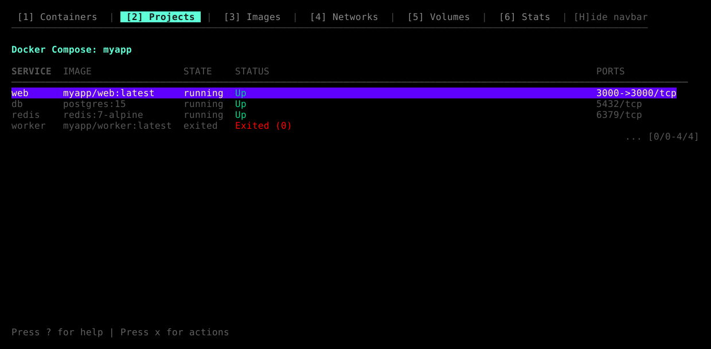
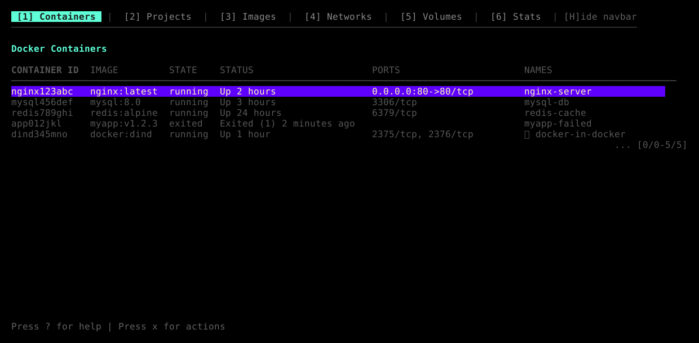
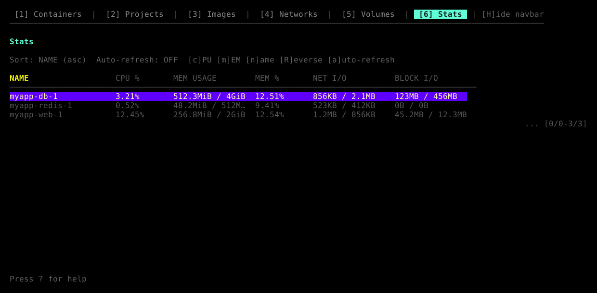
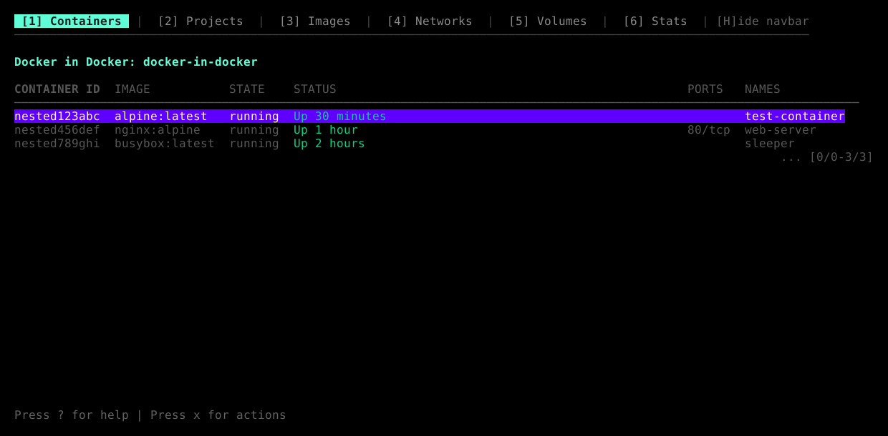
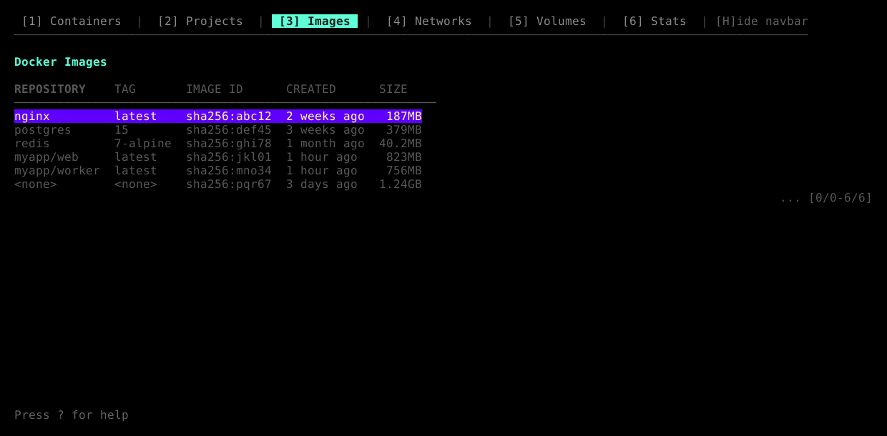
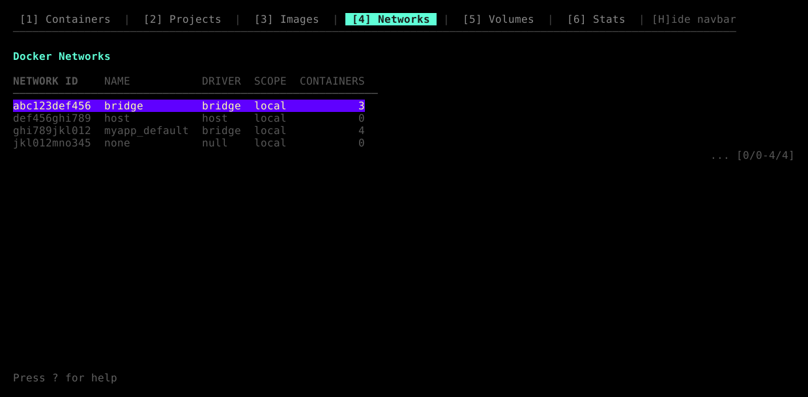
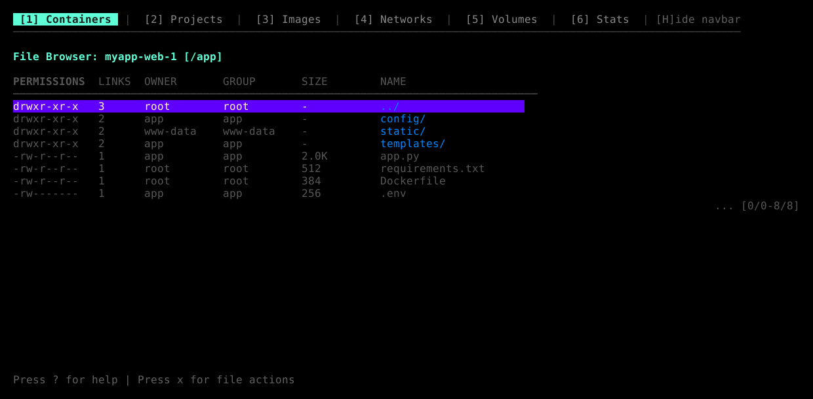
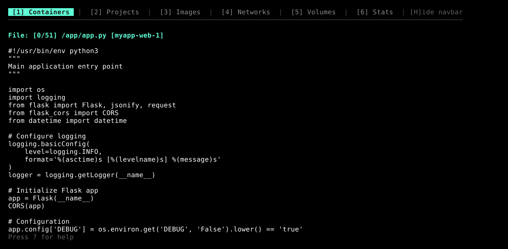
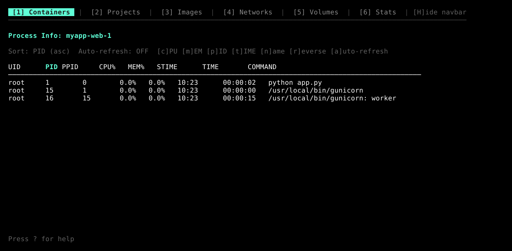
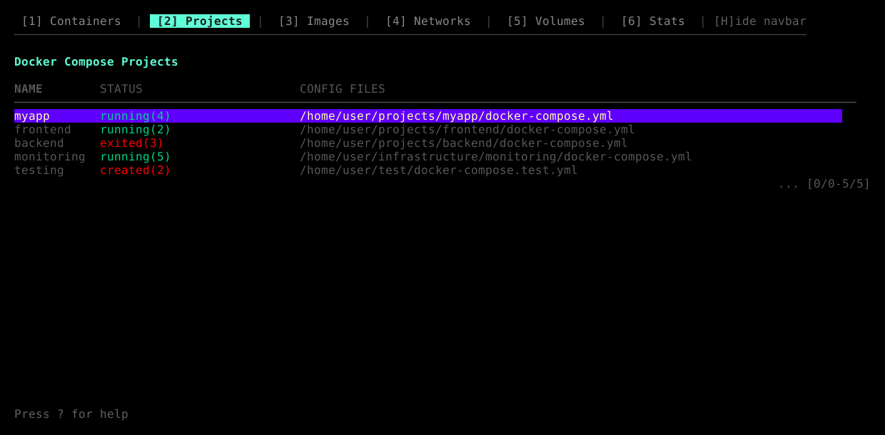

# dcv - Docker Container Viewer

DCV is a TUI (Terminal User Interface) tool for monitoring Docker containers and Docker Compose applications.

## Screenshots

<table>
  <tr>
    <td></td>
    <td></td>
  </tr>
  <tr>
    <td></td>
    <td></td>
  </tr>
</table>

## Features

- View all Docker containers (both standalone and Docker Compose managed)
- List and manage Docker images
- List and manage Docker networks
- List and manage Docker volumes with size information
- Browse files inside containers
- Execute shell commands in containers
- Inspect container configuration
- List and manage Docker Compose containers
- Switch between multiple Docker Compose projects
- Real-time container log streaming (shows last 1000 lines, then follows new logs)
- Manage containers inside Docker-in-Docker (dind) containers
- Vim-style key bindings and command-line interface
- Help view accessible with `?` key
- Quit confirmation dialog for safer exits
- Display executed commands for debugging

## Views

For a complete list of keyboard shortcuts and commands, see [docs/keymap.md](docs/keymap.md).

### Docker Container List View

Displays `docker ps` results in a table format. Shows all Docker containers, not limited to Docker Compose.


For keyboard shortcuts, see [docs/keymap.md](docs/keymap.md#docker-container-list).

### Docker Compose Process List View

Displays `docker compose ps` results in a table format.


For keyboard shortcuts, see [docs/keymap.md](docs/keymap.md#docker-compose-process-list).

### Log View

Displays container logs. Initially shows the last 1000 lines, then streams new logs in real-time.


For keyboard shortcuts, see [docs/keymap.md](docs/keymap.md#log-view).

### Docker-in-Docker Process List View

Shows containers running inside a dind container.



For keyboard shortcuts, see [docs/keymap.md](docs/keymap.md#docker-in-docker).

### Image List View

Displays Docker images with repository, tag, ID, creation time, and size information.



For keyboard shortcuts, see [docs/keymap.md](docs/keymap.md#image-list).

### Network List View

Displays Docker networks with ID, name, driver, scope, and container count.



For keyboard shortcuts, see [docs/keymap.md](docs/keymap.md#network-list).

### Volume List View

Displays Docker volumes with name, driver, scope, size, creation time, and reference count.


For keyboard shortcuts, see [docs/keymap.md](docs/keymap.md#volume-list).

### File Browser View

Browse the filesystem inside a container. Navigate directories and view file contents.



For keyboard shortcuts, see [docs/keymap.md](docs/keymap.md#file-browser).

### File Content View

View the contents of a file from within a container.



For keyboard shortcuts, see [docs/keymap.md](docs/keymap.md#file-content).

### Inspect View

Displays the full Docker inspect output for containers, images, or networks in JSON format with syntax highlighting.


For keyboard shortcuts, see [docs/keymap.md](docs/keymap.md#inspect-view).

### Top View

Shows process information (docker compose top) for the selected container.



For keyboard shortcuts, see [docs/keymap.md](docs/keymap.md#top-view).

### Stats View

Shows container resource usage statistics including CPU, memory, network I/O, and block I/O.


For keyboard shortcuts, see [docs/keymap.md](docs/keymap.md#stats-view).

### Compose Project List View

Shows all Docker Compose projects on the system.



For keyboard shortcuts, see [docs/keymap.md](docs/keymap.md#project-list).

### Help View

Shows all available keyboard shortcuts and their corresponding commands for the current view.


The help view displays three columns:
- **Key**: The keyboard shortcut (e.g., 'j' or 'down')
- **Command**: The vim-style command that can be used in command mode (e.g., ':down')
- **Description**: What the action does

For keyboard shortcuts, see [docs/keymap.md](docs/keymap.md#help-view).

### Command Mode

Vim-style command line interface for executing commands.

**Built-in commands:**
- `:q` or `:quit`: Quit the application (with confirmation)
- `:q!` or `:quit!`: Force quit without confirmation
- `:h` or `:help`: Show help view
- `:help commands`: List all available commands in current view

All key handler functions can be called as commands. For a complete list of available commands in each view, see [docs/keymap.md](docs/keymap.md#command-mode) or use `:help commands` in command mode.

## Usage

### Options

```bash
dcv [-debug <logfile>]
```

- `-debug <logfile>`: Enable debug logging to a file

### Examples

```bash
# Start dcv with the default initial view (docker containers)
dcv

# Start dcv with debug logging
dcv -debug dcv.log

# Configure initial view via config file (see Configuration section)
# To start with Docker Compose view: set initial_view = "compose" in config
# To start with project list: set initial_view = "projects" in config
```

## Configuration

DCV supports configuration through a TOML file located at:
- `~/.config/dcv/config.toml` - User config directory

### Configuration Options

```toml
[general]
# Initial view to show on startup
# Valid values: "docker", "compose", "projects"
# Default: "docker"
initial_view = "docker"
```

### Example Configuration

```bash
# Create config directory
mkdir -p ~/.config/dcv

# Create config file
cat > ~/.config/dcv/config.toml << EOF
[general]
initial_view = "compose"
EOF
```

## Installation

### Using Homebrew (macOS and Linux)

```bash
brew tap tokuhirom/tap
brew install dcv
```

Or install directly:

```bash
brew install tokuhirom/tap/dcv
```

### Using go install

```bash
go install github.com/tokuhirom/dcv@latest
```

### Download from GitHub Releases

Pre-built binaries are available on the [releases page](https://github.com/tokuhirom/dcv/releases) for:
- Linux (amd64, arm64, armv7)
- macOS (amd64, arm64)
- Windows (amd64)

### Building from source

```bash
git clone https://github.com/tokuhirom/dcv.git
cd dcv
go build -o dcv
./dcv
```

## Requirements

- Go 1.23 or later (for building from source)
- Docker and Docker Compose installed
- Terminal with TUI support

## Known Issues

### Snap-packaged Docker

If you're using Docker installed via snap (common on Ubuntu), the helper binary injection feature may fail due to snap confinement restrictions. Snap's security model prevents Docker from accessing files in `/tmp` and other system directories.

**Workaround**: The helper injection will use your home directory for temporary files. Ensure your home directory has sufficient space for temporary files (a few MB).

**Note**: This limitation only affects the file browser's helper injection feature. All other dcv functionality works normally with snap-packaged Docker.

## Implementation Details

- Language: Go
- TUI Framework: [Bubble Tea](https://github.com/charmbracelet/bubbletea)
- Styling: [Lipgloss](https://github.com/charmbracelet/lipgloss)
- Testing: testify

### Architecture

- Uses Model-View-Update (MVU) pattern
- Async log streaming
- Shows executed commands on error for easier debugging
- Comprehensive unit tests

## Command Execution View

Shows real-time output when executing Docker commands (start, stop, restart, kill, rm, docker compose up/down).

For keyboard shortcuts, see [docs/keymap.md](docs/keymap.md#command-execution).

## Debugging Features

- Commands are displayed when executing operations
- Real-time streaming output for all Docker operations
- Error messages with exit codes
- Color-coded status indicators (success/failure)

## Development

### Setting up development environment

```bash
# Install all development dependencies including lefthook
make dev-deps
```

This will install:
- golangci-lint for linting
- goimports for code formatting
- lefthook for git hooks

### Git Hooks (Lefthook)

This project uses [lefthook](https://github.com/evilmartians/lefthook) to ensure code quality:

- **Pre-commit**: Automatically formats Go code and runs quick tests
- **Pre-push**: Runs full linting and test suite

To manually run hooks:
```bash
lefthook run pre-commit
lefthook run pre-push
```

### Running tests

```bash
make test
```

### Building

```bash
make all
```

### Formatting code

```bash
make fmt
```

## Release Process

Releases are automated using [GoReleaser](https://goreleaser.com/) and GitHub Actions.

### Creating a New Release

1. **Ensure all changes are committed and pushed to main branch**

2. **Create and push a new tag**:
   ```bash
   git tag v0.1.0  # Replace with your version
   git push origin v0.1.0
   ```

3. **GitHub Actions will automatically**:
   - Run tests
   - Build binaries for multiple platforms
   - Create a GitHub release with the binaries
   - Update the Homebrew tap formula

### Release Configuration

- **GoReleaser**: Configuration is in `.goreleaser.yml`
- **GitHub Actions**: Release workflow is in `.github/workflows/ci.yml`
- **Homebrew Tap**: Formula is automatically updated in `tokuhirom/homebrew-tap`

### Required Secrets

The following secrets must be set in the GitHub repository settings:

- `TAP_GITHUB_TOKEN`: Fine-grained Personal Access Token with:
  - Repository access to `tokuhirom/homebrew-tap`
  - Permissions: Contents (Read and Write), Metadata (Read)

### Version Naming

Follow semantic versioning (MAJOR.MINOR.PATCH):
- MAJOR: Breaking changes
- MINOR: New features (backwards compatible)
- PATCH: Bug fixes (backwards compatible)

## See also

- [lazydocker](https://github.com/jesseduffield/lazydocker)

## License

```
The MIT License (MIT)

Copyright © 2025 Tokuhiro Matsuno, https://64p.org/ <tokuhirom@gmail.com>

Permission is hereby granted, free of charge, to any person obtaining a copy
of this software and associated documentation files (the "Software"), to deal
in the Software without restriction, including without limitation the rights
to use, copy, modify, merge, publish, distribute, sublicense, and/or sell
copies of the Software, and to permit persons to whom the Software is
furnished to do so, subject to the following conditions:

The above copyright notice and this permission notice shall be included in
all copies or substantial portions of the Software.

THE SOFTWARE IS PROVIDED "AS IS", WITHOUT WARRANTY OF ANY KIND, EXPRESS OR
IMPLIED, INCLUDING BUT NOT LIMITED TO THE WARRANTIES OF MERCHANTABILITY,
FITNESS FOR A PARTICULAR PURPOSE AND NONINFRINGEMENT. IN NO EVENT SHALL THE
AUTHORS OR COPYRIGHT HOLDERS BE LIABLE FOR ANY CLAIM, DAMAGES OR OTHER
LIABILITY, WHETHER IN AN ACTION OF CONTRACT, TORT OR OTHERWISE, ARISING FROM,
OUT OF OR IN CONNECTION WITH THE SOFTWARE OR THE USE OR OTHER DEALINGS IN
THE SOFTWARE.
```